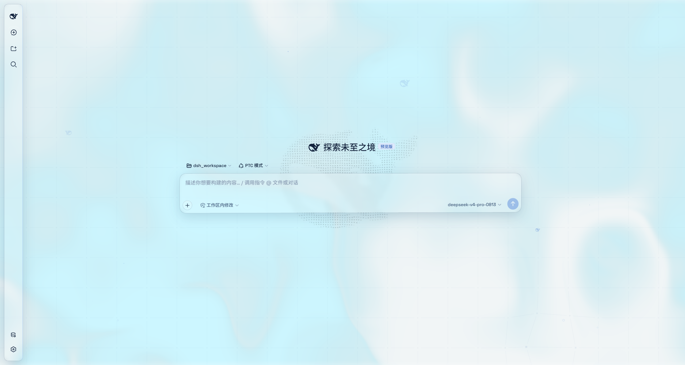
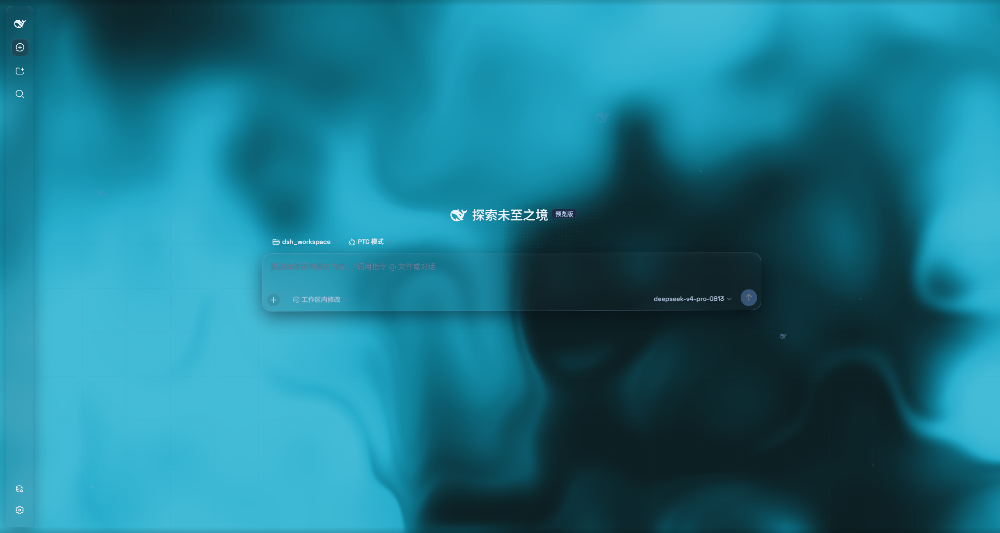
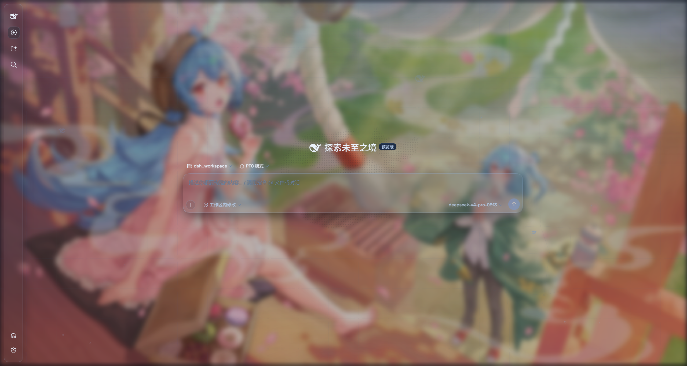
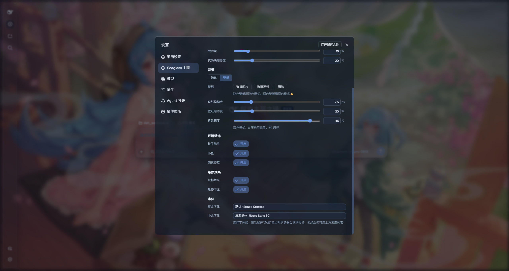

# @deepseek-ai/dsh-client-ui-seaglass

[English](README.md) | 中文

> **适配版本** — DSH `0.1.2-rc.1` · **更新日期** 2026-09-05 · 插件 v1.5.0

Seaglass 是一个高自由度的玻璃质感主题。把许多页面做成了磨砂玻璃片，你可以自定义图片和视频作为背景。关掉开关就回到原生界面，不改 DSH 任何一行源码。如果你喜欢该主题，欢迎提出建议或者拉到本地修改并提交PR。






## 特性

- **双模式**：**云母效果**把布局改成悬浮玻璃卡片；**兼容模式**保持原版排版一字不动，只把材质换成通用玻璃
- **自由切换图像或视频背景**
- **一键开关**：关闭即完全还原原生界面
- **中/英文字体自定义**

## 安装

### 方式一：npm 一键安装（推荐）

```sh
dsh plugin --profile web add dsh-client-ui-seaglass
```

从 npm 安装最新版，自动注册为 profile 插件层（`dsh.bundle` 补丁），所有平台通用。刷新 Web 界面即可。

### 方式二：本地文件夹安装（要调试 / 修改主题源码 → 推荐这条路）

把仓库克隆到本地任意位置，直接链接进 profile 的 `node_modules`。仓库自带构建产物，克隆完链接上就能用；改源码后重新构建一次即可看到效果——不走 npm 发版，改完立刻能验证。

> `$DSH_HOME` 即 DSH 的数据目录，默认在用户主目录下的 `.dsh`。

```sh
git clone https://github.com/xiyunyunyun/dsh-client-ui-seaglass.git
cd dsh-client-ui-seaglass
pnpm install
```

把克隆位置链接进 profile（`<仓库路径>` 换成你的实际路径）：

**Windows：**

```bat
mklink /J "%DSH_HOME%\profiles\web\node_modules\@deepseek-ai\dsh-client-ui-seaglass" "<仓库路径>"
```

**macOS / Linux：**

```sh
ln -s "<仓库路径>" "$DSH_HOME/profiles/web/node_modules/@deepseek-ai/dsh-client-ui-seaglass"
```

在 `$DSH_HOME/profiles/web/cordis.patch.yml` 里登记插件（幂等，已登记过就跳过）：

```yaml
- insert:
    - id: ui-seaglass
      name: '@deepseek-ai/dsh-client-ui-seaglass'
```

刷新 Web 界面即可加载。

**修改源码后重新构建：**

```sh
pnpm bundle     # 产物输出到 lib/client.js；pnpm watch 可监听自动重建
```

重启 DSH 后生效。